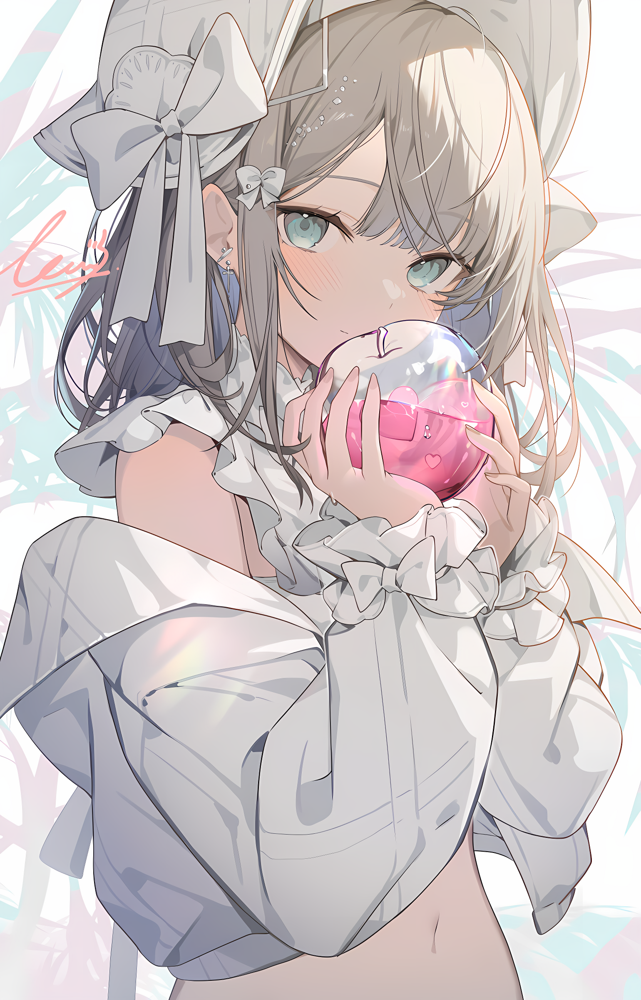

<!-- background image -->

---

<!-- Section : Visitors & last-commit & followers -->
  

-----

>_Thanks to time, thank you for all the encounters._  
<!-- @deprecated : Updated
    >**承蒙时光不弃，感谢一切相遇**  
    >_Thanks to time, thank you for all the encounters._
-->

📱 **My Account**

<!-- tags -->
开源社区账号  

  
社交平台账号  

 
电子邮箱  

🌟 **My Skills** 

<!--START_SECTION:waka-->

🐟 **My Fishing**
<table> <!-- template by EpicMo -->
  <tr>
    <th>
      
    </th>
    <th>
       
    </th>
  </tr>
  <tr>
    <td colspan=2>
      
    </td>
  </tr>
  <tr>
    <td colspan=2>
      
    </td>
  </tr>
</table>
